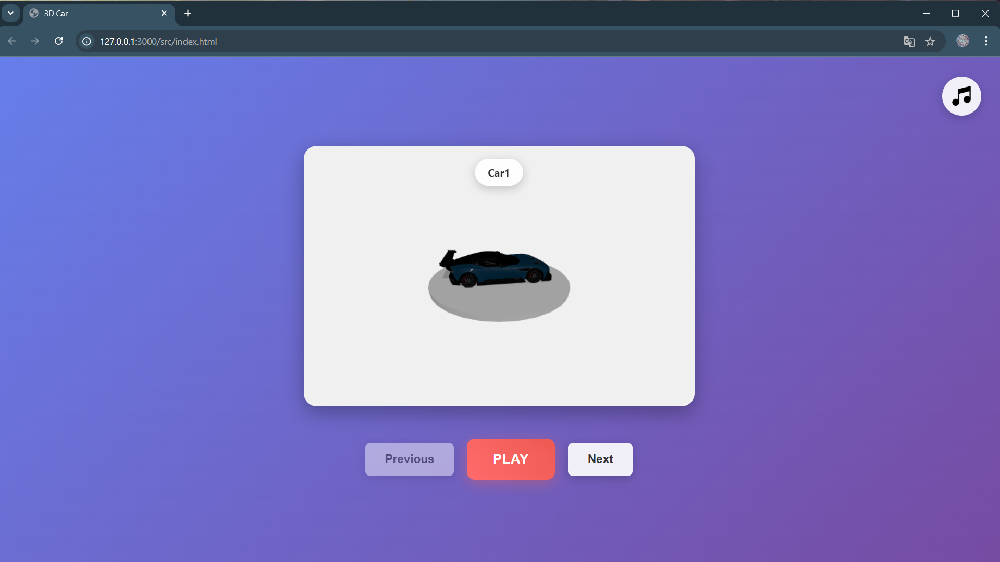
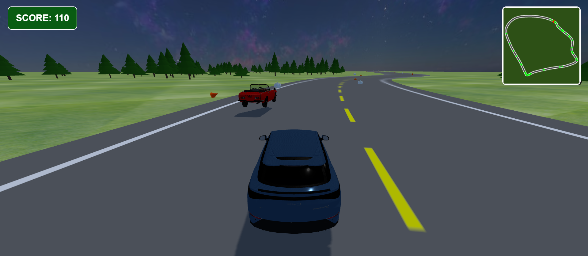

# Đồ án Mô phỏng Lái Xe 3D

Một trò chơi mô phỏng lái xe 3D sử dụng **Three.js** và **Cannon-es**, tích hợp minimap, hiệu ứng pháo hoa, thu thập vật phẩm, AI xe bot, âm thanh động cơ và địa hình động. Người chơi sẽ chọn xe và điều khiển trong một môi trường được sinh tự động.

---

## Cấu trúc thư mục

```
Source/
├── libs/        
├── model/
├── music/
├── pic/ 
├── src/
│   ├── agent.js
│   ├── car_ui.js
│   ├── chunking.js
│   ├── firework.js
│   ├── Game.js
│   ├── helper.js
│   ├── house.js 
│   ├── road.js 
│   ├── teapot.js 
│   ├── traffic.js  
│   ├── tree.js 
│   ├── style.css 
│   └── index.html 
```

---

## Hướng dẫn chạy

### Yêu cầu:

- Kết nối Internet để tải thư viện từ CDN:
  - Three.js
  - Cannon-es
  - GLTFLoader, TeapotGeometry (qua unpkg)

### Các bước thực hiện:

1. Cài **extension Live Server** trong VSCode
2. Mở thư mục `Source/` trong VSCode
3. Click chuột phải vào `index.html` → chọn **“Open with Live Server”**
4. Trình duyệt sẽ mở game tại địa chỉ `http://localhost:8080` 

---

## Hướng dẫn

| Phím      | Tác dụng                    |
|-----------|-----------------------------|
| **W**     | Tăng tốc                    |
| **S**     | Phanh / Lùi                |
| **A / D** | Rẽ trái / Rẽ phải           |
| **R**     | Reset lại vị trí xe         |

- Chọn xe và nhấn **Play** để bắt đầu trò chơi
- Theo dõi **tốc độ**, **minimap** và **điểm số** ở góc màn hình

---

## Âm thanh trong game

- **Nhạc nền**: có thể **bật/tắt** bằng nút **Music** ở màn hình chọn xe
- **Âm thanh động cơ**: thay đổi **tự động theo tốc độ xe**

---

## Các tính năng nổi bật

- **Môi trường mở rộng**: Sinh nhà, cây, rào chắn, bản đồ vô hạn bằng chunk
- **Minimap thời gian thực**: Hiển thị vị trí xe và vật phẩm
- **Hệ thống điểm và vật phẩm**: Thu thập ấm trà để tăng điểm, kèm hiệu ứng pháo hoa
- **Xe tự hành**: Bot điều khiển chạy quanh đường
- **Skybox, texture cỏ, đường**: Môi trường sinh động
- **Reset**: Khi xe ra khỏi bản đồ

---

## Công nghệ & Thư viện sử dụng

- [Three.js](https://threejs.org/)
- [Cannon-es](https://github.com/pmndrs/cannon-es)
- [GLTFLoader](https://threejs.org/docs/#examples/en/loaders/GLTFLoader)
- `TeapotGeometry`
- [Blender](https://www.blender.org/)

---

## Hình ảnh minh họa

| Giao diện chọn xe | Giao diện chơi game |
|-------------------|----------------------|
|  |  |

---
